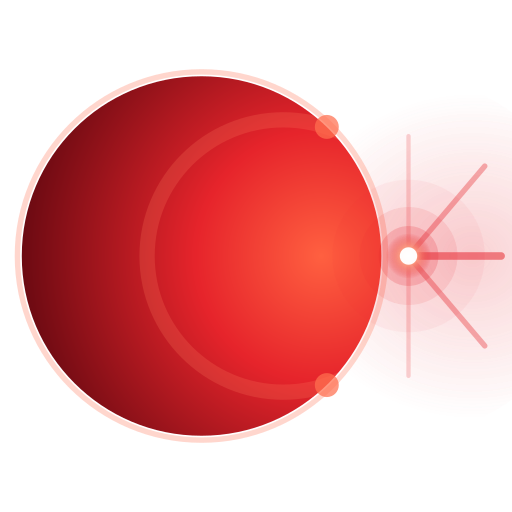

<p align="center">
	
</p>

<h1 align="center">Suora 朔枢</h1>

<p align="center">
	<strong>本地优先的桌面 AI 工作台。</strong>
	<br />
	<strong>A local-first desktop AI workbench.</strong>
</p>

<p align="center">
	Chat · Documents · Models · Agents · Skills · Pipeline · Timer · Channels · MCP · Settings
</p>

<p align="center">
	<a href="https://fandych.github.io/suora/"></a>
	<a href="https://github.com/fandych/suora/releases"></a>
	<a href="https://github.com/fandych/suora/releases"></a>
</p>

<p align="center">
	<a href="https://fandych.github.io/suora/"><strong>Docs</strong></a>
	·
	<a href="https://github.com/fandych/suora/releases"><strong>Releases</strong></a>
	·
	<a href="https://github.com/fandych/suora/blob/main/FEATURES.md"><strong>Features</strong></a>
	·
	<a href="https://github.com/fandych/suora/blob/main/docs/technical/TECHNICAL_DOC_EN.md"><strong>Technical Docs</strong></a>
</p>

## What Suora Is / 它是什么

Suora is an Electron-based AI workbench for local knowledge work, automation, and integrations.

Suora 不是单一聊天窗口，而是一个把对话、文档、Agent、技能、流水线、定时任务、渠道接入和 MCP 集成放在同一个桌面应用中的工作台。

## Current Product Surface

| Module | Current role |
| --- | --- |
| Chat | Conversations, attachments, tool calls, and pipeline commands |
| Documents | Local notes, folders, backlinks, graph, and chat context |
| Models | Provider setup, model enablement, testing, and compare |
| Agents | Built-in and custom agents with testing and versioning |
| Skills | Installed skills, registry browsing, `SKILL.md` editing, and import/export |
| Pipeline | Multi-step agent workflows with history and Mermaid preview |
| Timer | Once / interval / cron schedules |
| Channels | External messaging integrations and reply routing |
| MCP | MCP server configuration |
| Settings | Preferences, security, data, logs, and system diagnostics |

## Why It Feels Different

- local-first desktop workspace instead of a browser-only shell
- chat, documents, automation, and integrations in one app
- multi-provider model strategy with BYOK and local-model support
- built-in agents, skills, pipelines, timers, channels, and MCP as real product modules

## Get Started

### Download

Get the latest build from:

- <https://github.com/fandych/suora/releases/latest>

### Run from source

```bash
npm install
npm run dev
```

### First useful setup order

1. Configure at least one model in `Models`
2. Start a conversation in `Chat`
3. Create a local knowledge area in `Documents`
4. Add automation in `Pipeline` and `Timer`
5. Connect external channels only when needed

## Documentation Map

The repo now keeps a smaller maintained documentation set:

| Doc | Purpose |
| --- | --- |
| [FEATURES.md](./FEATURES.md) | Short capability index |
| [docs/user/USER_GUIDE_ZH.md](./docs/user/USER_GUIDE_ZH.md) | Primary Chinese user guide |
| [docs/user/USER_GUIDE_EN.md](./docs/user/USER_GUIDE_EN.md) | Primary English user guide |
| [docs/technical/TECHNICAL_DOC_ZH.md](./docs/technical/TECHNICAL_DOC_ZH.md) | Primary Chinese technical reference |
| [docs/technical/TECHNICAL_DOC_EN.md](./docs/technical/TECHNICAL_DOC_EN.md) | Primary English technical reference |
| [docs/TESTING.md](./docs/TESTING.md) | Testing and validation notes |
| [docs/CHANNEL_INTEGRATION.md](./docs/CHANNEL_INTEGRATION.md) | Channel setup and runtime notes |
| [docs/requirements.md](./docs/requirements.md) | Scope and requirements baseline |

GitHub Pages is built from `website/` with Docusaurus and publishes `website/build`.

## Development

### Common commands

```bash
npm install
npm run dev
npm run build
npm run preview
npm run package
npm run lint
npm run type-check
npm run test:run
npm run test:e2e
```

## Security Notes

- API keys prefer OS-backed secure storage
- if secure storage is unavailable, keys remain in memory only
- filesystem access can be sandboxed
- tool execution can require confirmation

## License

MIT
